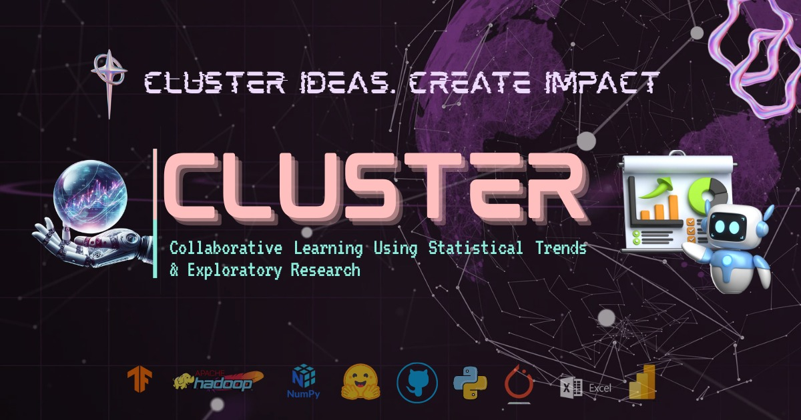

<p align="center">
  
</p>

<h1 align="center">🌐 CLUSTER: Data Science Club Portal</h1>

<p align="center">
  Your gateway to collaborative data science learning, contribution, and innovation.
</p>

<p align="center">
  <a href="https://github.com/CLUSTER-DS-Club/cluster/stargazers"></a>
  <a href="https://github.com/CLUSTER-DS-Club/cluster/network/members"></a>
  <a href="https://github.com/CLUSTER-DS-Club/cluster/issues"></a>
  <a href="https://github.com/CLUSTER-DS-Club/cluster/pulls"></a>
  <a href="https://github.com/CLUSTER-DS-Club/cluster/graphs/contributors"></a>
  
  
  
  
</p>

---

## 📚 What is CLUSTER?

> **CLUSTER** is the official platform of the **CLUSTER Data Science Club** that empowers students to collaborate, learn, and contribute to real-world data science and AI projects.

We focus on:

- 📊 Data Analysis & Visualization
- 🤖 Machine Learning Projects
- 🧠 Natural Language Processing
- 👁️‍🗨️ Computer Vision
- 🧪 MLOps, Deployment, and more...

---

## 🚀 Getting Started

### 🧰 Prerequisites

- Node.js ≥ 18
- npm or yarn

### 🧪 Installation

```bash
git clone https://github.com/CLUSTER-DS-Club/cluster.git
cd cluster
npm install
npm run dev
````

---

## 🗂️ Project Structure

```
cluster/
├── public/              # Static assets
├── src/                 
│   ├── components/      # Reusable UI components
│   ├── pages/           # Application pages
│   └── App.jsx          # Root component
├── index.html
├── vite.config.js
└── package.json
```

---

## 💡 Features

* 🔥 Vite + React based modern frontend
* 🎨 Styled with TailwindCSS
* 📁 Modular folder structure
* 🌐 Responsive & accessible UI
* 🌟 Beginner-friendly open-source project

---

## 🤝 Contributing

We welcome all contributions, big or small!

```bash
# 1. Fork the repo
# 2. Create your feature branch
git checkout -b feature/AmazingFeature

# 3. Commit your changes
git commit -m "Add some amazing feature"

# 4. Push to the branch
git push origin feature/AmazingFeature

# 5. Open a Pull Request
```

📜 Please read our [Contributing Guide](CONTRIBUTING.md) and [Code of Conduct](CODE_OF_CONDUCT.md).

---

## 🧠 Contributors

<a href="https://github.com/CLUSTER-DS-Club/cluster/graphs/contributors">
  
</a>

---

## 📄 License

This project is licensed under the **MIT License** - see the [LICENSE](LICENSE) file for details.

---

## 📬 Stay Connected

* 💬 [Join our Discord](#) `(Coming Soon)`
* 🧠 [Follow us on LinkedIn](https://www.linkedin.com/company/cluster-vips/)
* 📣 [Contribute to our Newsletter](#) `(Coming Soon)`

<p align="center">
  <b>Made with ❤️ by CLUSTER DS Club</b>
</p>
